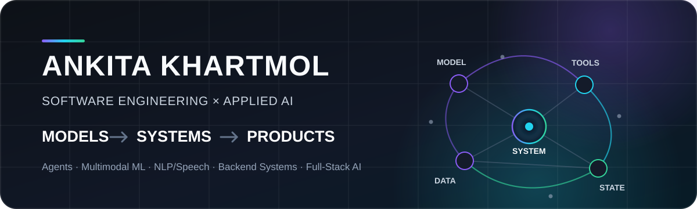

<p align="center">
  
</p>

<p align="center">
  <a href="https://www.linkedin.com/in/ankitakhartmol/"><strong>LinkedIn</strong></a>
  &nbsp;•&nbsp;
  <a href="https://github.com/Ankita2525?tab=repositories"><strong>Repositories</strong></a>
</p>

---

## About

I’m a **Software Engineer building applied AI systems and production software**.

I’m especially interested in the layer between **“the model works”** and **“the system works reliably”** - agents that use tools, retrieval systems grounded in real data, evaluation pipelines, backend systems with explicit state, and AI workflows with observable and verifiable behavior.

- 🎓 **MS in Computer Science - University of Southern California**
- 🔬 **Research:** robustness and evaluation of vision-language models
- ⚙️ **Previously:** production software, NLP/voice systems, APIs, and ML inference at Harman
- 🎯 **Focus:** Agentic AI · AI Evaluation · Multimodal ML · Backend Systems · Full-Stack AI

---

## Selected Engineering

<table>
<tr>
<td width="50%" valign="top">

### 🚨 [OpsPilot](https://github.com/Ankita2525/opspilot)

**Autonomous production engineering agent**

Investigates live service incidents using metrics, logs, deployment context, and runtime evidence; generates evidence-grounded root-cause hypotheses; gates risky remediation behind human approval; and verifies recovery using fresh post-action telemetry.

`Python` `FastAPI` `Next.js` `PostgreSQL` `Prometheus` `OpenTelemetry` `Grafana Loki` `Groq` `Docker` `Cloud Run`

**Signal:** agentic AI · observability · human-in-the-loop safety · verified remediation

[**Live Demo**](https://opspilot-chi.vercel.app)

</td>
<td width="50%" valign="top">

### 🧬 [RepoVerse](https://github.com/Ankita2525/RepoVerse)

**RAG-powered intelligence for software repositories**

Turns GitHub repositories into searchable engineering knowledge by ingesting source files, generating summaries and embeddings, storing vectors in PostgreSQL, and retrieving grounded context for codebase Q&A.

`Next.js` `TypeScript` `Gemini` `LangChain` `PostgreSQL` `pgvector`

**Signal:** code RAG · semantic retrieval · GitHub integrations · full-stack AI

</td>
</tr>

<tr>
<td width="50%" valign="top">

### 🎙️ [ConvoWeave AI](https://github.com/Ankita2525/ConvoWeave-AI)

**Real-time AI agents for live meetings**

Connects reusable AI agents to live meetings, then carries the conversation into post-meeting workflows through recording, transcription, background processing, summaries, and contextual Ask-AI experiences.

`Next.js` `TypeScript` `OpenAI Realtime` `Stream` `tRPC` `Inngest`

**Signal:** realtime AI · speech/audio workflows · event-driven processing · persistent context

</td>
<td width="50%" valign="top">

### 📅 [SchedMate AI](https://github.com/Ankita2525/Schedmate-AI)

**Agentic scheduling with verified tool execution**

A local-first scheduling agent where the LLM handles intent and tool selection while deterministic application code handles calendar state, conflict detection, persistence, time parsing, and execution verification.

`Python` `FastAPI` `LangChain` `Ollama` `FAISS` `WebSockets`

**Signal:** tool-calling agents · semantic memory · guardrails · async backend

</td>
</tr>
</table>

---

## Research + ML

### 🔬 Robustness Evaluation of Vision-Language Models - USC

Studying how multimodal models behave under visual and linguistic perturbations, with an emphasis on **robustness, evaluation, alignment, and failure analysis**.

`Vision-Language Models` · `Multimodal Evaluation` · `Model Robustness`

### 🌐 [Semantic Drift in Code-Switched Context](https://github.com/Ankita2525/Semantic-Drift-in-Code-Switched-Context)

A multilingual data-quality and experiment-enablement pipeline for converting noisy code-switched corpora into clean, aligned, reproducible ML-ready datasets.

`Multilingual NLP` · `Code Switching` · `LID / NER` · `Data Pipelines`

### 🧑‍🏫 [LearnFlow AI](https://github.com/Ankita2525/LearnFlow-AI)

A stateful multi-agent learning system where specialized agents refine an objective, collaborate on curriculum planning, synthesize a syllabus, and guide the learner through it.

`Multi-Agent Systems` · `LLM Orchestration` · `Stateful AI` · `Human-in-the-Loop`

---

## How I Build AI Systems

```text
          context / data
                ↓
        ┌────────────────┐
        │  model / agent │
        └───────┬────────┘
                │ reason + choose
                ↓
        ┌────────────────┐
        │ tools / APIs   │
        └───────┬────────┘
                │ validate + execute
                ↓
        ┌────────────────┐
        │ state / data   │
        └───────┬────────┘
                │ observe + verify
                ↓
        ┌────────────────┐
        │    product     │
        └────────────────┘
